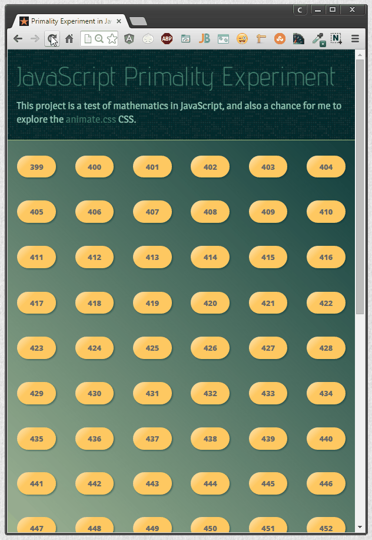

# HTML5 Primality Game

   

A browser-based numbers game in HTML5 and JavaScript. Tests your skill at identifying prime numbers in a given range.

#### Development

Development of this project will occur in the `develop` branch and stable releases will be tagged in the `master` branch. The example is hosted on [GitHub Pages](https://pages.github.com/), and is built from the `gh-pages` branch.

This project uses [Bower](http://bower.io) for front-end dependencies. After cloning the repository, run `bower install` to download the required packages into the `components/` directory.

#### License

This experiment is released under the [MIT License](http://opensource.org/licenses/MIT).

___
   
